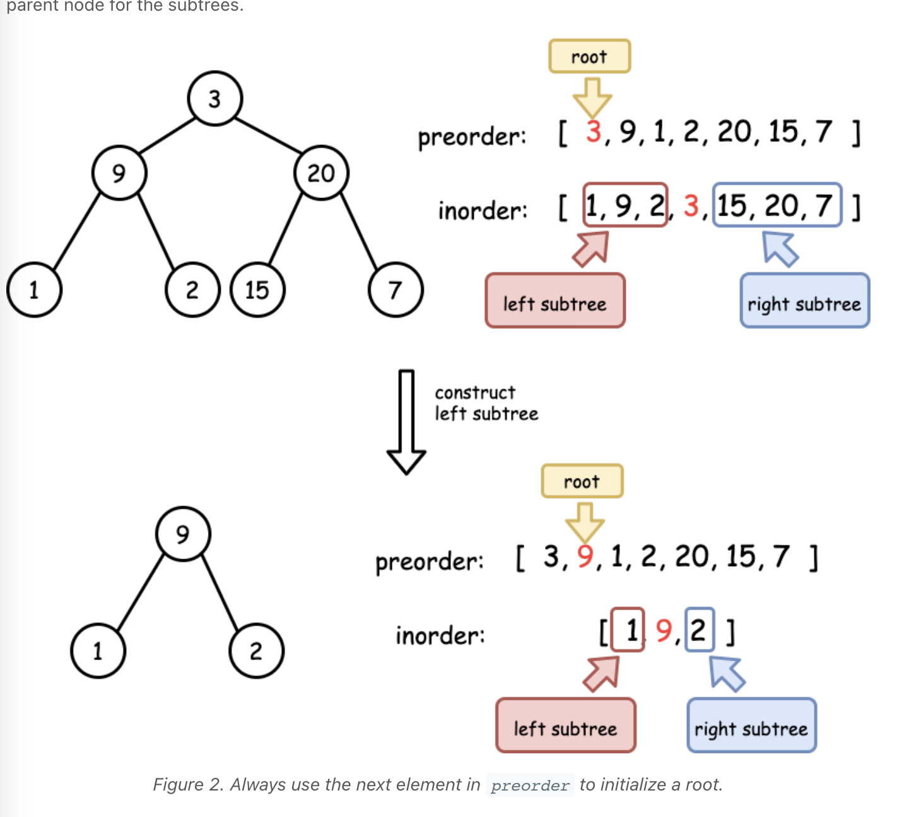

# Tree Traversal 

## Preorder 

- Traversal 순서가 current -> left -> right 임. 
- 첫 번째 요소가 루트를 가리킨다.  

## Inorder 

- Traversal 순서는 left -> current -> right 임. 
- Traversal 을 따라가서 출력을 하면 왼쪽 -> 오른쪽 순서대로 트리의 노드가 출력됨.
- 특정한 정점을 기준으로 subTree 가 나눠짐. 이건 이미지로 보면 명확할 듯.  

